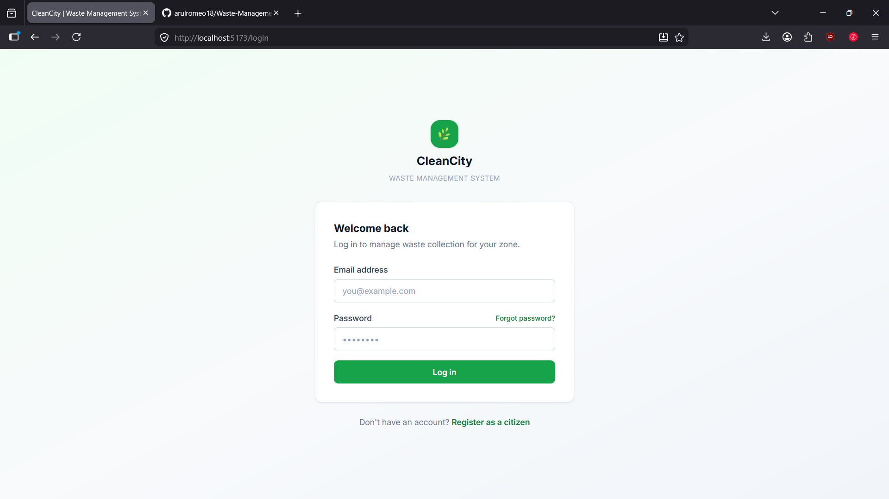
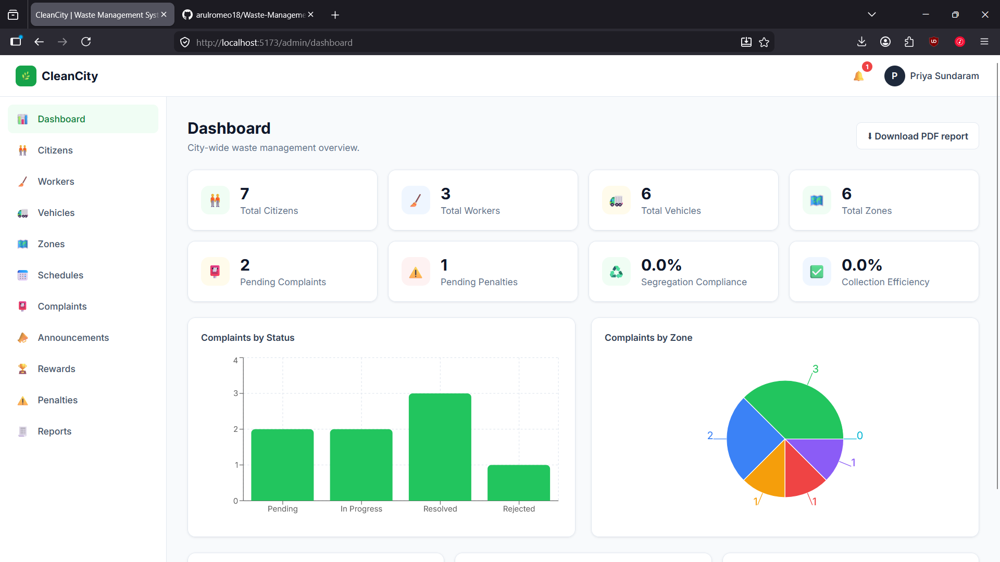
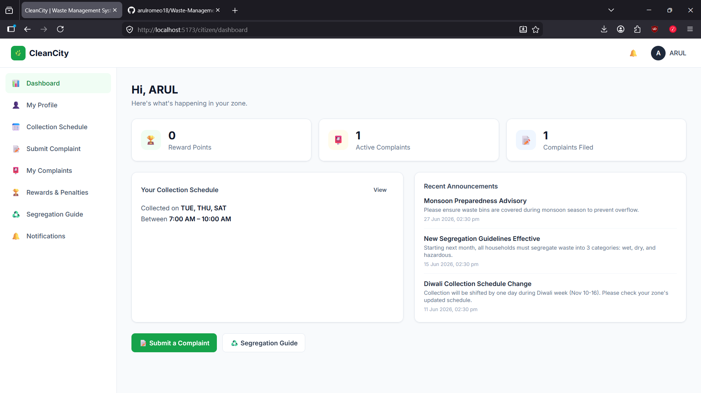
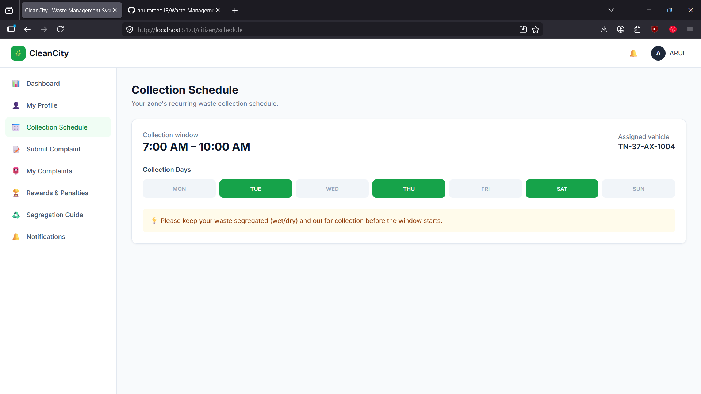
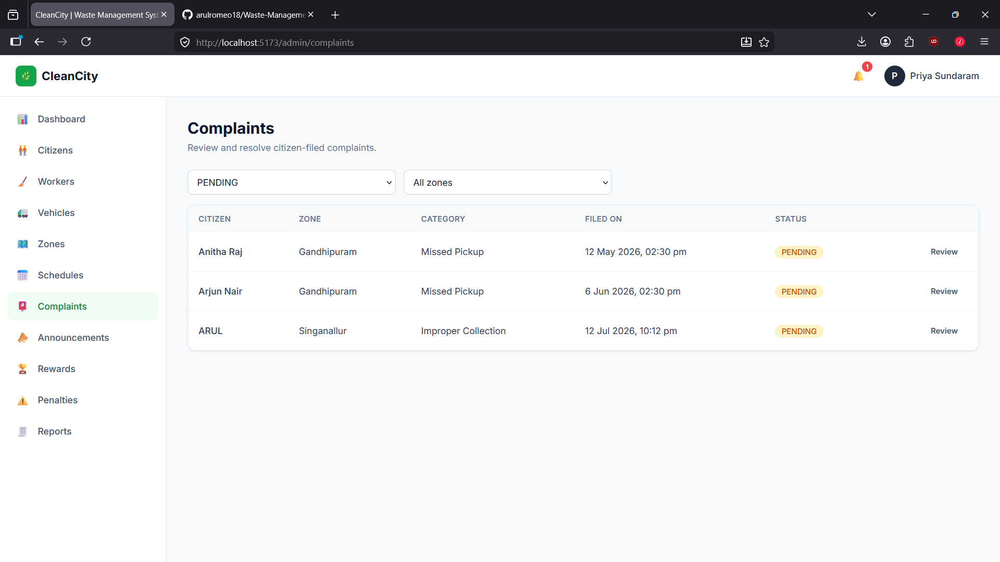
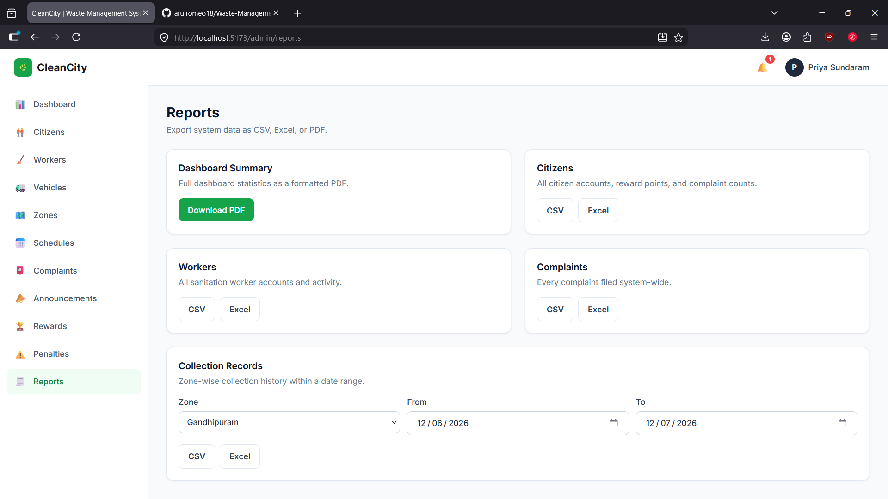
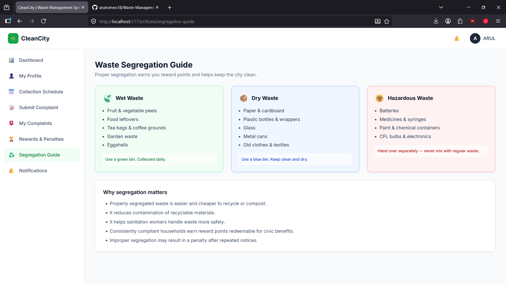

# ♻️ CleanCity — Waste Segregation Monitoring System for Urban Local Bodies


# 📌 Project Overview

**CleanCity** is a full-stack Waste Segregation Monitoring System developed as a college academic project to help Urban Local Bodies efficiently manage waste collection, monitor waste segregation compliance, and improve communication between citizens, sanitation workers, and administrators.

The system provides secure authentication, role-based dashboards, complaint management, collection scheduling, analytics, report generation, and notification services.

# 🚀 Tech Stack

## Backend

- Java 21
- Spring Boot 3.3.5
- Spring Security (JWT Authentication)
- Spring Data MongoDB
- MongoDB Atlas
- Maven
- Lombok
- iText7 (PDF Reports)
- Apache POI (Excel Export)
- Apache Commons CSV

## Frontend

- React (Vite)
- Tailwind CSS
- Axios
- React Router

## Database

- MongoDB Atlas
# 📸 Screenshots

## 🔐 Login Page



---

## 📊 Super Admin Dashboard



---

## 👤 Citizen Dashboard



---

## 📅 Collection Schedule



---

## 📝 Complaint Management



---

## 📈 Analytics Dashboard



---

## ♻️ Waste Segregation Guide



# ✨ Features

## 👨‍💼 Super Admin

- Dashboard with analytics and charts
- Manage Citizens
- Manage Sanitation Workers
- Manage Vehicles
- Manage Collection Zones
- Manage Collection Schedules
- Review and resolve complaints
- Publish announcements
- Award reward points
- Issue or waive penalties
- Export reports as PDF, Excel, and CSV
- Audit logging

## 🚛 Sanitation Worker

- View assigned routes
- View collection schedule
- Log completed collections
- Upload before and after collection photos
- Mark waste segregation compliance

## 👥 Citizen

- Self-registration
- JWT login
- Forgot/Reset password using Email OTP
- View collection schedule
- Submit complaints with photo evidence
- Track complaint status
- View reward points
- Waste segregation guide
- Receive notifications

## 🔒 Security

- JWT Authentication
- Role-Based Access Control (RBAC)
- BCrypt Password Hashing
- Protected REST APIs
- Image Upload Support
- Audit Logging

# 📁 Folder Structure

```text
Waste management/
│
├── src/
├── pom.xml
├── mvnw
├── mvnw.cmd
│
└── waste-management-frontend/
    └── frontend/
        ├── src/
        ├── public/
        ├── package.json
        └── vite.config.js
```

# ✅ Prerequisites

- Java 21
- Node.js
- Maven
- MongoDB Atlas Account
- Git

# ⚙️ Backend Configuration

Edit:

```properties
src/main/resources/application.properties
```

Configure:

```properties
# MongoDB
spring.data.mongodb.uri=YOUR_MONGODB_URI
spring.data.mongodb.database=YOUR_DATABASE_NAME

# JWT
jwt.secret=YOUR_SECRET_KEY
jwt.expiration=86400000

# Email
spring.mail.username=YOUR_EMAIL
spring.mail.password=YOUR_APP_PASSWORD
```

# ▶️ Run Backend

```bash
./mvnw spring-boot:run
```

Windows:

```bash
mvnw.cmd spring-boot:run
```

Backend URL:

```text
http://localhost:8080
```

# 💻 Run Frontend

```bash
cd waste-management-frontend/frontend
npm install
npm run dev
```

Frontend URL:

```text
http://localhost:5173
```

# 🌐 Environment Variables

| Variable | Description |
|----------|-------------|
| `spring.data.mongodb.uri` | MongoDB Atlas Connection URI |
| `spring.data.mongodb.database` | Database Name |
| `jwt.secret` | JWT Secret Key |
| `jwt.expiration` | JWT Expiration Time |
| `spring.mail.username` | Email Address |
| `spring.mail.password` | Email App Password |

# 📊 Reports

The application supports exporting reports in:

- PDF
- Excel (.xlsx)
- CSV


# 👥 User Roles

| Role | Description |
|------|-------------|
| Super Admin | Complete system administration |
| Sanitation Worker | Waste collection management |
| Citizen | Complaint submission, schedules, rewards, and notifications |

# 🎓 Academic Project

This project was developed as a **college academic project** to demonstrate full-stack web development using **Spring Boot**, **React**, and **MongoDB Atlas**.

# 📄 License

This project is licensed under the **MIT License**.
